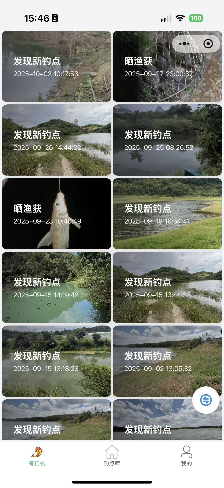
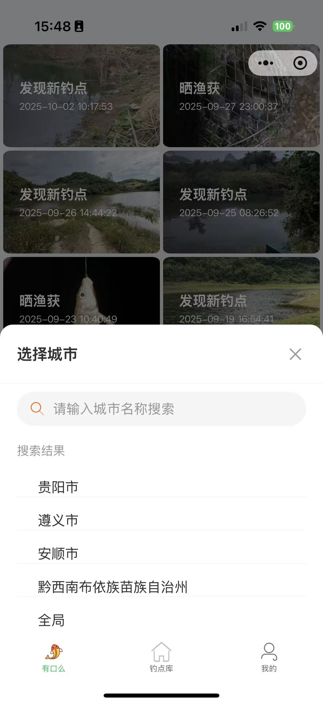
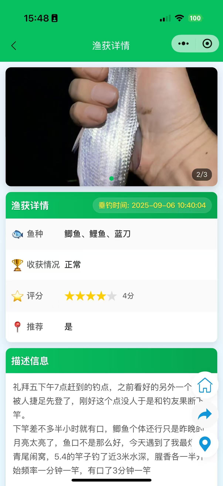
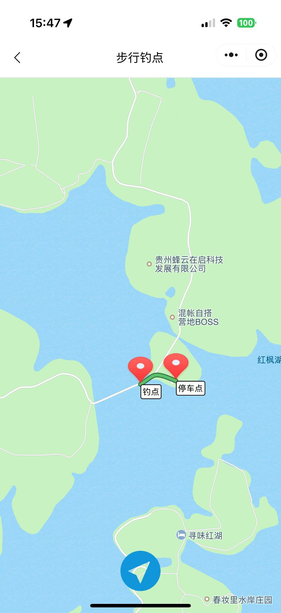

# openfwm_mini

## Project Introduction

openfwm_mini is a WeChat Mini Program designed for fishing enthusiasts, providing functions such as fishing spot query, real-time sharing of fishing conditions, and user personal center to help fishing enthusiasts better enjoy fishing.

## Features

### Main Functions
- **Any Biting**: View and share real-time fishing conditions at various spots
- **Spots Library**: Browse, search and discover nearby fishing locations
- **My Profile**: Manage personal information, view credit records, etc.

### Technical Features
- Based on WeChat Mini Program development framework
- Developed using TypeScript for better type safety
- Supports user geographic location authorization, providing location-based services
- Custom navigation bar and bottom tab bar

## Project Structure

```
├── miniprogram/
│   ├── pages/               # Page files
│   │   ├── anybiting/       # Any Biting page
│   │   ├── spots/           # Spots Library page
│   │   ├── my/              # My Profile page
│   │   ├── home/            # Home related pages
│   │   ├── login/           # Login page
│   │   └── ...
│   ├── components/          # Custom components
│   ├── service/             # Service layer (API calls, etc.)
│   ├── utils/               # Utility functions
│   ├── images/              # Image resources
│   ├── app.ts               # Application entry file
│   ├── app.json             # Global configuration
│   └── app.less             # Global styles
├── typings/                 # TypeScript type definitions
└── project.config.json      # Project configuration file
```

## Installation and Development

### Requirements
- WeChat Developer Tools
- Node.js environment

### Installation Steps
1. Clone the repository:
   ```bash
   git clone https://gitee.com/your-username/openfwm_mini.git
   ```
2. Import the project using WeChat Developer Tools
3. Install dependencies:
   ```bash
   npm install
   ```
4. Compile and preview the project

## Usage Instructions

### Main Page Functions

1. **Any Biting**:
   - View fishing conditions shared by other anglers
   - Share your own fishing experience

2. **Spots Library**:
   - Browse nearby fishing locations
   - Search for fishing spots in specific areas
   - View spot details and reviews

3. **My Profile**:
   - View and edit personal information
   - Check credit level and records
   - Read user agreement and privacy policy

## Interface Showcase

Here are some screenshots of the Mini Program, displayed in a three-column layout:

| Home Page | City Switch | Spot Details |
|-----------|-------------|--------------|
|  |  |  |

| Spots Library | Catch Display | Navigation |
|---------------|--------------|------------|
|  |  |  |

### Permissions
The Mini Program requires the following permissions:
- Location permission: Used to provide location-based spot recommendations and positioning functions

## Contribution Guidelines

All developers are welcome to contribute to the project!

### Contribution Process
1. Fork the repository
2. Create a Feature branch (`git checkout -b feature/amazing-feature`)
3. Commit your changes (`git commit -m 'Add some amazing feature'`)
4. Push to the branch (`git push origin feature/amazing-feature`)
5. Open a Pull Request

### Development Standards
- Follow the existing code style of the project
- Ensure the code compiles successfully before committing
- Please clearly describe the changes in commit messages

## License

[Add license information here, such as MIT License]

## Contact Us

If you have any questions or suggestions, please feel free to contact us through:
- Submitting Issues
- Pull Request

---

*Let's build a better fishing experience together!*
