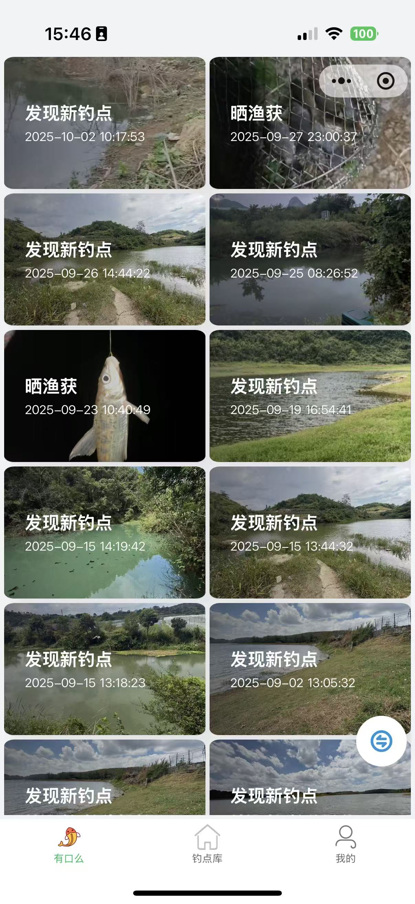
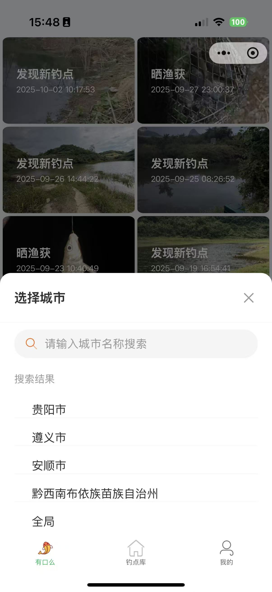
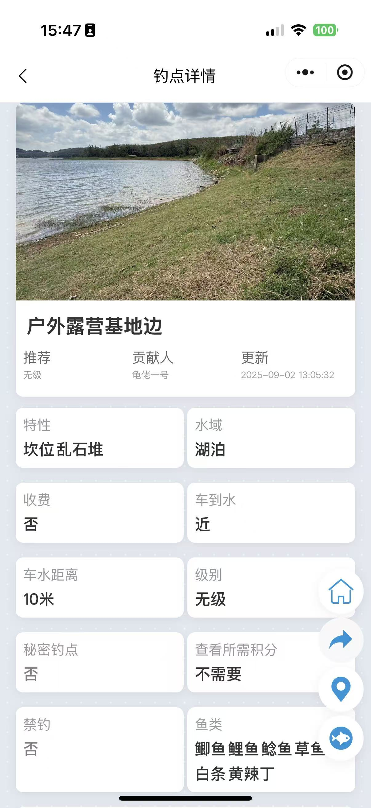
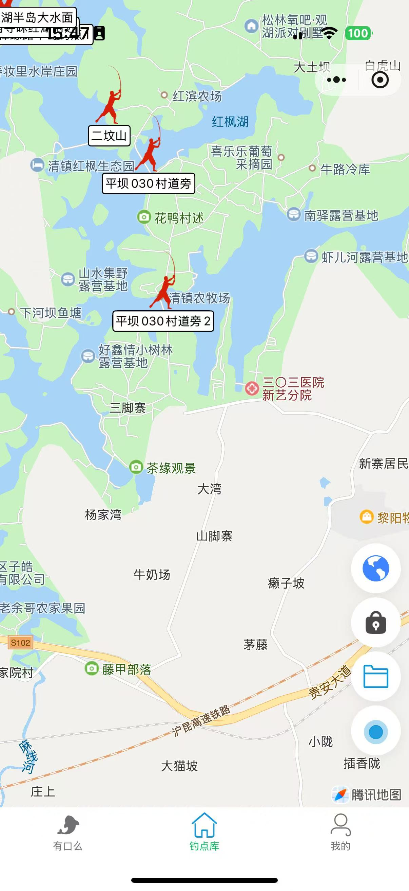
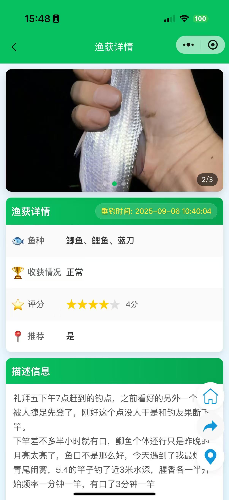
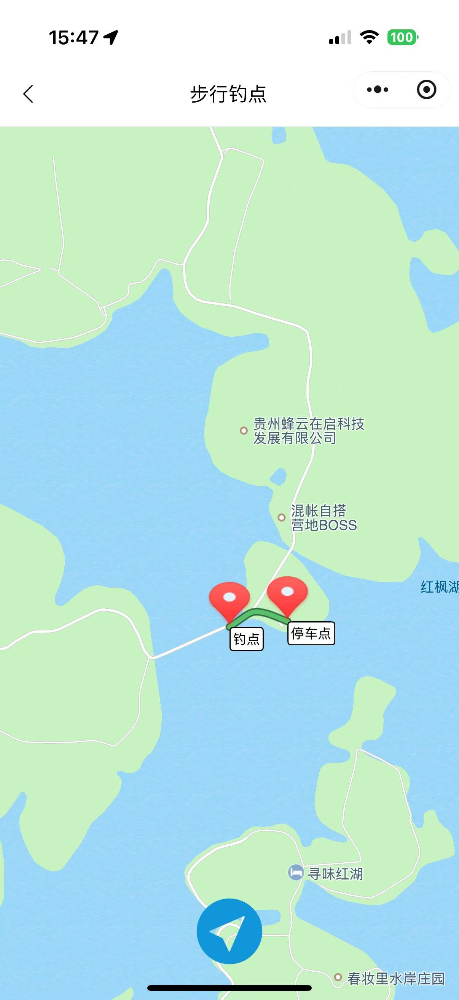

## 项目介绍

openfwm_mini 是一款专为钓鱼爱好者设计的微信小程序，提供钓点查询、钓鱼情况实时分享以及用户个人中心等功能，帮助钓鱼爱好者更好地享受钓鱼乐趣。

## 功能特点

### 主要功能
- **有口么**：实时查看和分享各钓点的钓鱼情况
- **钓点库**：浏览、搜索和发现附近的钓鱼地点
- **个人中心**：管理个人信息、查看积分记录等

### 技术特点
- 基于微信小程序开发框架
- 使用 TypeScript 进行开发，提供更好的类型安全
- 支持用户地理位置授权，提供基于位置的服务
- 自定义导航栏和底部标签栏

## 项目结构

```
├── miniprogram/
│   ├── pages/               # 页面文件
│   │   ├── anybiting/       # 有口么页面
│   │   ├── spots/           # 钓点库页面
│   │   ├── my/              # 个人中心页面
│   │   ├── home/            # 首页相关页面
│   │   ├── login/           # 登录页面
│   │   └── ...
│   ├── components/          # 自定义组件
│   ├── service/             # 服务层（API调用等）
│   ├── utils/               # 工具函数
│   ├── images/              # 图片资源
│   ├── app.ts               # 应用入口文件
│   ├── app.json             # 全局配置
│   └── app.less             # 全局样式
├── typings/                 # TypeScript类型定义
└── project.config.json      # 项目配置文件
```

## 安装与开发

### 环境要求
- 微信开发者工具
- Node.js 环境

      

### 安装步骤
1. 克隆本仓库：
   ```bash
   git clone https://gitee.com/sgyang/openfwm_mini.git
   ```
2. 使用微信开发者工具导入项目
3. 安装依赖：
   ```bash
   npm install
   ```
4. 配置项目ID
   - 打开project.config.json,找到"appid": "YOUR_APP_ID",替换YOUR_APP_ID为您的微信小程序ID。
5. 配置API后台接口
   - 项目中找到`miniprogram/service/request.js`，修改以下API接口配置
   - 关于后台项目的部署和配置，请参考文档下方的[相关项目链接](#相关项目链接)
   ```javascript
   // 在request.js文件中修改以下内容：
   this.baseUrl = "http://192.168.101.92:8081"; // API 服务接口
   this.imageUrl = "http://192.168.101.110";     // 图片服务接口
   ```
   - 请将上述IP地址替换为您实际部署的服务器地址
6. 编译并预览项目

## 使用说明

### 主要页面功能

1. **有口么**：
   - 查看其他钓友分享的钓鱼情况
   - 分享自己的钓鱼体验

2. **钓点库**：
   - 浏览附近的钓鱼地点
   - 搜索特定区域的钓点
   - 查看钓点详情和评价

3. **我的**：
   - 查看和编辑个人信息
   - 查看积分等级和记录
   - 阅读用户协议和隐私政策

## **线上项目**  
请**微信小程序搜索"圣刚钓鱼"**查看线上已部署项目。  

## 界面展示

以下是小程序的部分界面展示，按照三列布局排列：

| 首页 | 城市切换 | 钓点详情 |
|------|----------|---------|
|  |  |  |

| 钓点库 | 渔获展示 | 导航界面 |
|--------|---------|----------|
|  |  |  |


### 权限说明
小程序需要以下权限：
- 地理位置权限：用于提供基于位置的钓点推荐和定位功能

## 贡献指南

欢迎各位开发者参与项目贡献！

### 相关项目链接
- [微信小程序端](https://gitee.com/sgyang/openfwm_mini)
- [Android端](https://gitee.com/sgyang/openfwm_android)
- [管理端](https://gitee.com/sgyang/openfwm_mgr)

### 赞助倡议
各位钓友！​
作为免费开源的钓鱼平台，「一起钓鱼」从 0 到 1 全靠个人利用业余时间开发 —— 我们使用原生小程序 + Java 后端，和安卓端以及后台管理端，后续还会开发鸿蒙和IOS端，平台集成腾讯地图精准标钓点，只为让大家出钓少踩坑。​
但服务器维护、新功能迭代（比如离线钓点缓存、渔获数据统计）需要更多时间精力，现诚邀大家小额赞助！


### 贡献类型
- 新功能开发
- 性能优化
- 代码质量改进
- 文档完善
   

### 贡献流程
1. Fork 本仓库
2. 新建 Feature 分支 (`git checkout -b feature/amazing-feature`)
3. 提交代码 (`git commit -m 'Add some amazing feature'`)
4. 推送到分支 (`git push origin feature/amazing-feature`)
5. 开启 Pull Request

### 开发规范
- 代码风格遵循项目现有规范
- 提交前确保代码编译通过
- 提交信息请清晰描述改动内容

## 许可证

[GNU GPLv3](https://www.gnu.org/licenses/gpl-3.0.html)

## 联系我们

## 联系方式
如有问题,建议或者软件开发合作，请通过Issues或邮件联系项目维护者
email: answerme0918@foxmail.com
qq:314343793

---

*让我们一起打造更好的钓鱼体验！*